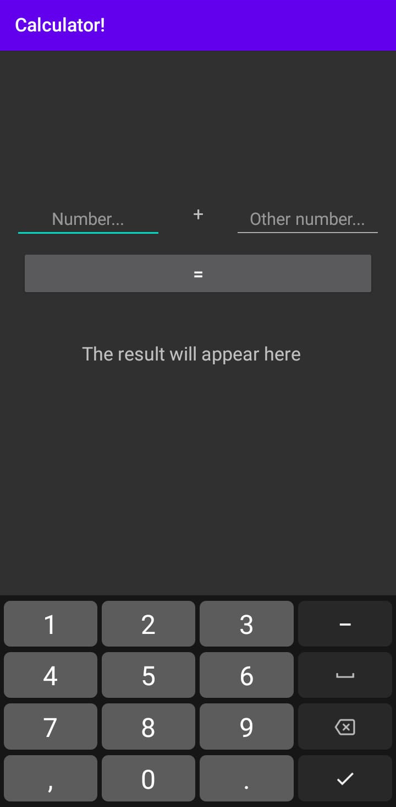

# Android-Prototypes
## SumApp
Allows addition of two numbers.

## TwoActivities
Shows the input from one activity on another.

## SensorApp
Along with displaying sensors and location, a message is shown if sudden acceleration is detected.

